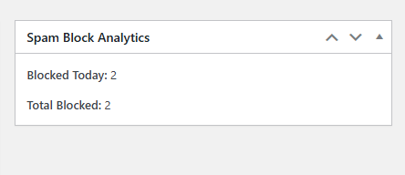
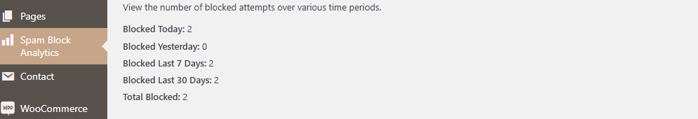

# Block Spam Orders with Advanced Analytics

**Version:** 1.4
**Author:** Akande Joshua
**Author URL:** [https://jits.ng](https://jits.ng)
**License:** GPL-2.0+

A WordPress plugin for WooCommerce to block spam orders by rejecting suspicious email patterns. Includes advanced analytics to track blocked attempts over different time periods.

---

## Features

- **Spam Email Blocking**:

  - Detects spam emails based on patterns from customer names (full name or first + last name) with random numbers and Gmail domains.
  - Blocks such emails during checkout and notifies the user with a message.

- **Advanced Analytics**:

  - Tracks the total number of blocked attempts.
  - Logs each block with a timestamp.
  - Provides detailed analytics for today, yesterday, last 7 days, last 30 days, and all time.

- **Dashboard Integration**:

  - Adds a widget to the WordPress dashboard showing total blocked orders and today's blocked attempts.

- **Admin Analytics Page**:
  - Dedicated page in the WordPress admin menu to view detailed block logs.
  - Real-time filtering by date range using a dropdown.

---

## Installation

1. Download the plugin files as a `.zip`.
2. Go to your WordPress Admin Dashboard > Plugins > Add New > Upload Plugin.
3. Choose the downloaded `.zip` file and click **Install Now**.
4. Activate the plugin.

---

## Usage

### Spam Detection

- The plugin automatically validates emails during WooCommerce checkout.
- It checks for two scenarios:
  - Emails derived from `billing_first_name` and `billing_last_name`.
  - Emails derived from `billing_full_name`.

Example of a blocked email pattern:
`JohnDoe.123456@gmail.com`

### Analytics

1. Visit the **Spam Block Analytics** page under the WordPress admin menu.
2. Use the dropdown to filter analytics by:
   - Today
   - Yesterday
   - Last 7 Days
   - Last 30 Days
   - All Time
3. The dashboard widget also provides a quick summary.

---

## Screenshots

### Dashboard Widget

### Detailed Analytics Page

---

## Changelog

### Version 1.4

- Added dual support for `billing_first_name` + `billing_last_name` and `billing_full_name`.
- Enhanced the admin analytics page with real-time date filtering.

### Version 1.3

- Introduced detailed analytics page.
- Added analytics widget to the WordPress dashboard.

### Version 1.2

- Initial version with basic spam email detection and logging.

---

## License

This plugin is licensed under the GPL-2.0+ license. See the [LICENSE](https://www.gnu.org/licenses/old-licenses/gpl-2.0.en.html) file for details.

---

## Support

For support or feature requests, please visit [https://jits.ng](https://jits.ng) or contact Akande Joshua on homezonic@gmail.com
